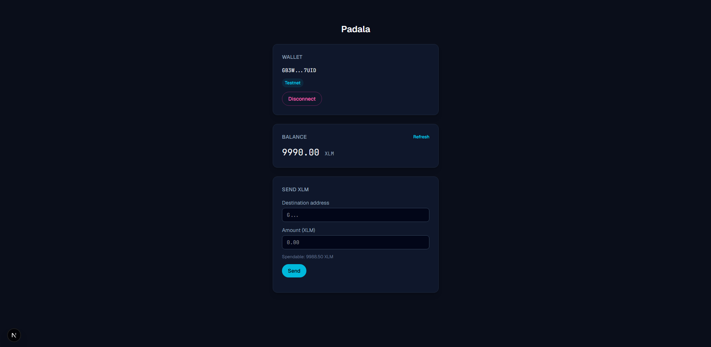
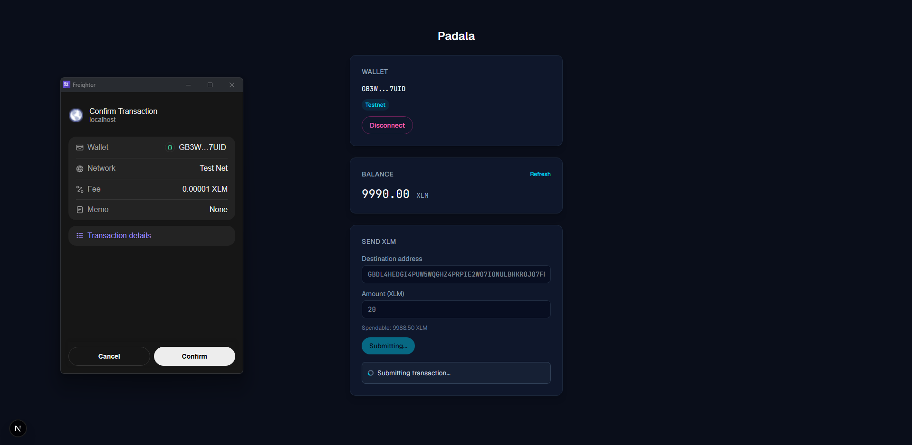
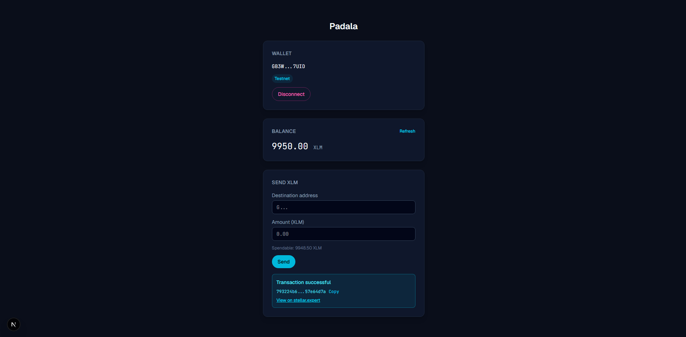

# Padala

A simple payment dApp on Stellar Testnet. Connect a Freighter wallet, view your XLM balance,
fund it via Friendbot, and send XLM to any testnet address with clear success/failure feedback.
Testnet only — no mainnet, no backend, no persistence.

## Tech stack

- Next.js 14+ (App Router), TypeScript
- Tailwind CSS
- [`@stellar/freighter-api`](https://www.npmjs.com/package/@stellar/freighter-api) for wallet connect/sign
- [`@stellar/stellar-sdk`](https://www.npmjs.com/package/@stellar/stellar-sdk) for Horizon queries and transaction building
- Stellar Testnet (`https://horizon-testnet.stellar.org`) + Friendbot for funding
- Deployed on Vercel

## Live demo

<!-- TODO: add the deployed Vercel URL here -->

## Setup

**Prerequisites**

- Node 18+
- pnpm
- [Freighter](https://freighter.app) browser extension, set to **Testnet**

**Install and run**

```bash
pnpm install
pnpm dev
```

Open [http://localhost:3000](http://localhost:3000). No environment variables are needed —
everything runs client-side against the public Horizon testnet endpoint.

## How to use

1. **Connect** — click "Connect Wallet" and approve the request in Freighter. If Freighter
   isn't on Testnet, the app will block transactions until you switch it.
2. **Fund** — a fresh address shows "Not funded yet". Click "Fund with Friendbot" to receive
   testnet XLM.
3. **Send** — enter a destination address and amount, click Send, and approve the signature
   in Freighter. The result banner shows the transaction hash with a link to stellar.expert.

## Screenshots

<!-- TODO: capture these and drop them in /screenshots -->

| Wallet connected | Balance displayed |
|---|---|
|  |  |

| Sending a transaction | Transaction result |
|---|---|
|  |  |
